# postman-api-tests
Postman 

Сегодня мы рассмотрим популярный инструмент Postman, позволяющий тестировать API даже новичкам.
Перед тем как начать, ознакомьтесь с данным материалом

HTTP - https://developer.mozilla.org/ru/docs/Web/HTTP/Overview

REST - https://habr.com/ru/post/38730/

Коды ответов - https://developer.mozilla.org/ru/docs/Web/HTTP/Status

Для начала познакомимся с тестируемых приложением https://github.com/berpress/flask-restful-api . Тестовое приложение имитирует работу магазина. Вы можете создавать пользователей, добавлять товар и оплачивать его, описание можно посмотреть здесь 
https://berpress.github.io/flask-restful-api/ . Также нам понадобиться сваггер (swagger) или его аналог с описанием эндроитов приложения, для нашего приложения он такой https://app.swaggerhub.com/apis-docs/berpress/flask-rest-api/1.0.0 .

Начнем писать тесты. Обратимся к нашему сваггеру. Точкой входа является метод POST/register для регистрации нового пользователя. У данного метода есть body:

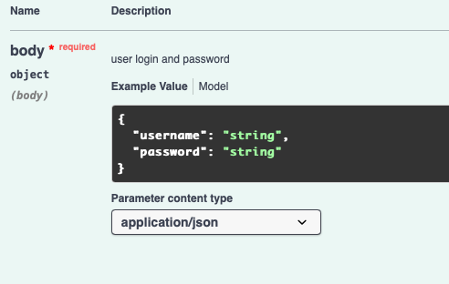

Создадим новую коллекцию

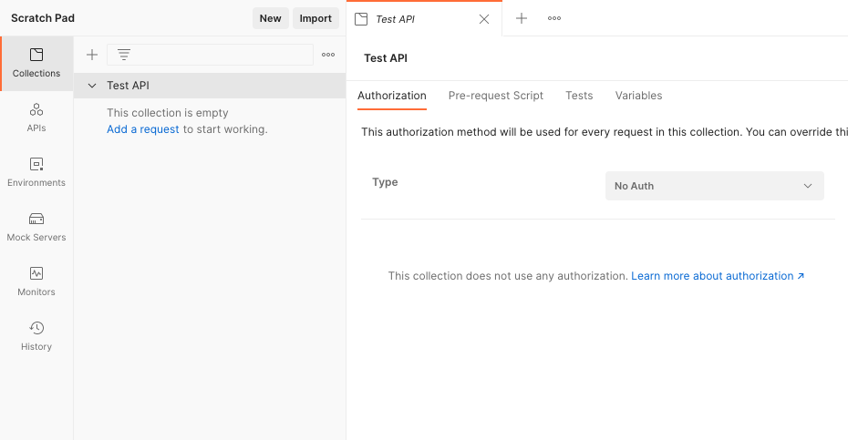

Давайте реализуем первый тест. Нам необходимо добавить новый запрос указать метод **POST** и url **/register**

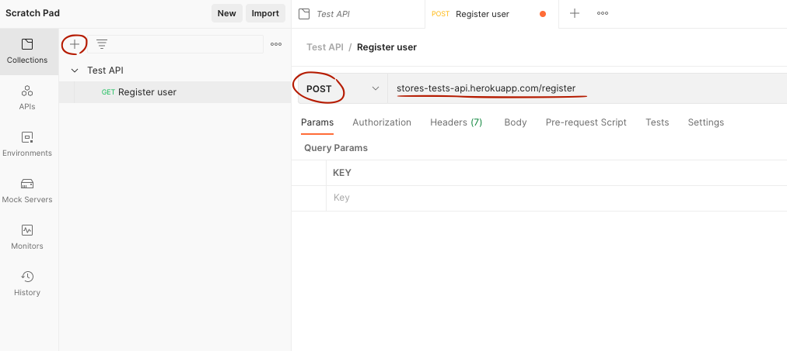

Теперь, согласно сваггеру, нам необходимо добавить **body**. Переходим в соответствующую вкладку, выбираем **raw -> JSON**. Описываем данные, которые мы хотим передать 
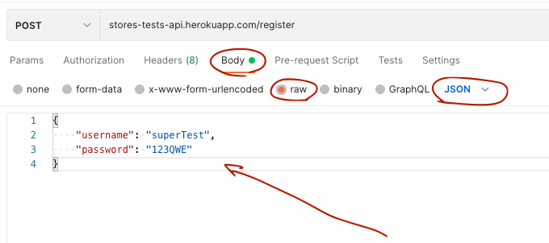

Нажимаем кнопку Send (в правом верхнем углу) и получаем результат

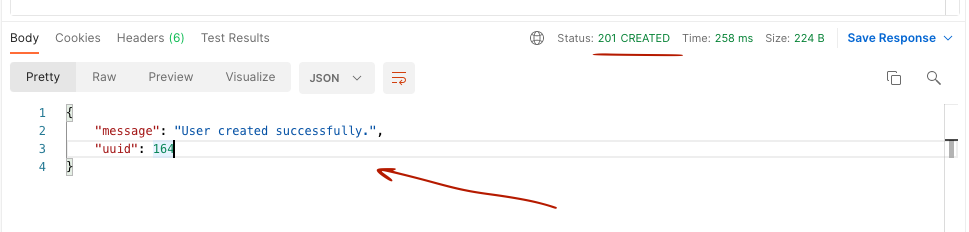
Поздравляю, наш первый тест прошел! Мы получили **response**, который описан в сваггере ( https://app.swaggerhub.com/apis-docs/berpress/flask-rest-api/1.0.0#/register/regUser ) и статус код **201**. 

Теперь сделаем аналогично для авторизации пользователя с теми данными, что мы использовали для метода /register. 
Используем **POST /auth** (https://app.swaggerhub.com/apis-docs/berpress/flask-rest-api/1.0.0#/auth/authUser)

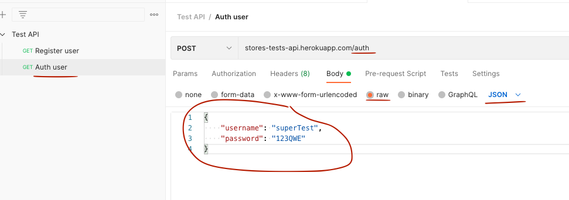

В результате получим стутс код 200 (успех) и в body респонса (response) токен, который нам пригодится для дальнейших действий в системе

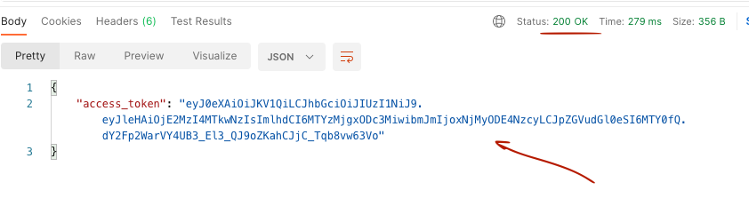

Теперь попробуем добавить раздел (store) в нашем магазине. Посмотрим описание в сваггере

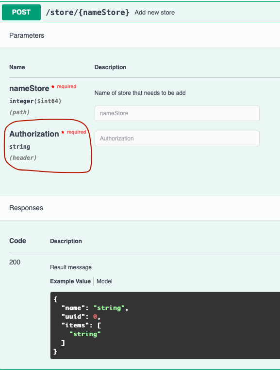

Кроме body необходимо указать **Authorization header**. Он будет иметь вид "Authorization": "JWT {token}". Токен (token) 
мы возьмем из предыдущего запроса /auth. Создадим новый запрос. Нам необходимо указать в **url имя раздела**, во вкладке **Authorization**
 выбрать тип **API Key**, в **Key** добавить **Authorization**, в **Value** указать токен, который был получен ранее 
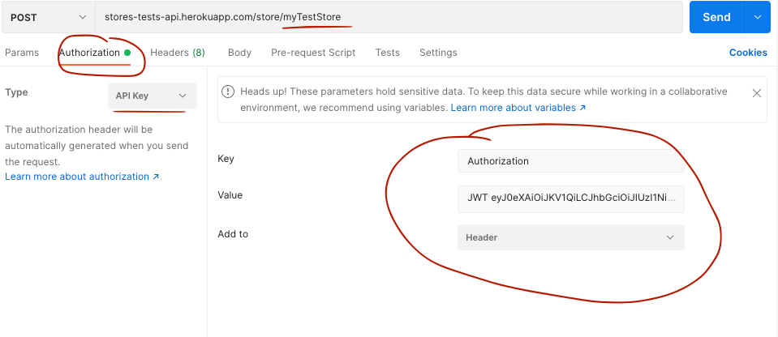

После запуска получаем 

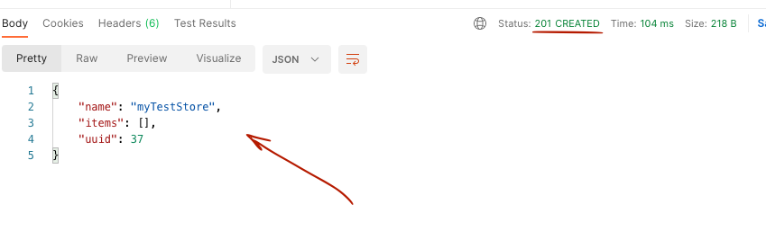

Наш тест успешно пройден! Статус код 201 (успех). 
А теперь попробуем запустить тест выше, но без **Authorization header**

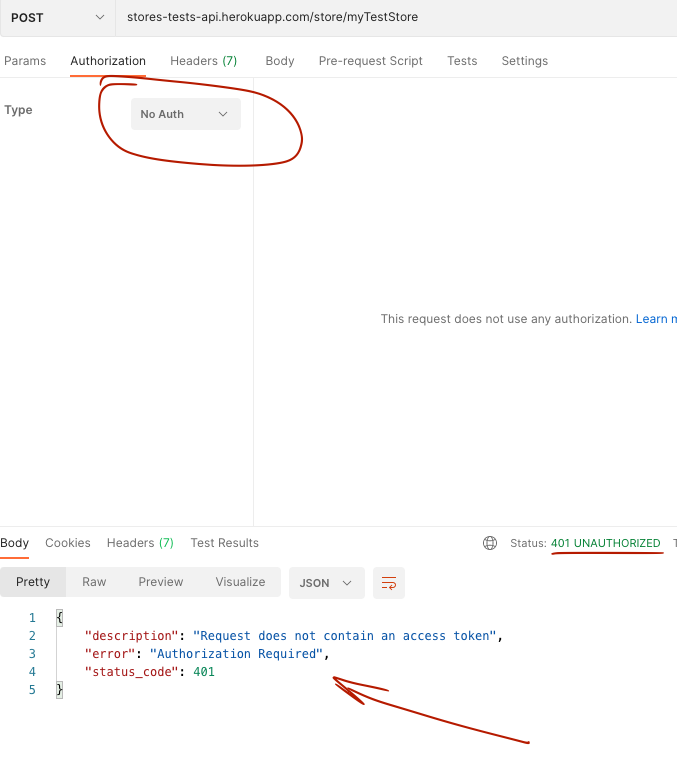

Мы получили статус **401** (Unauthorized), что и ожидалось.

